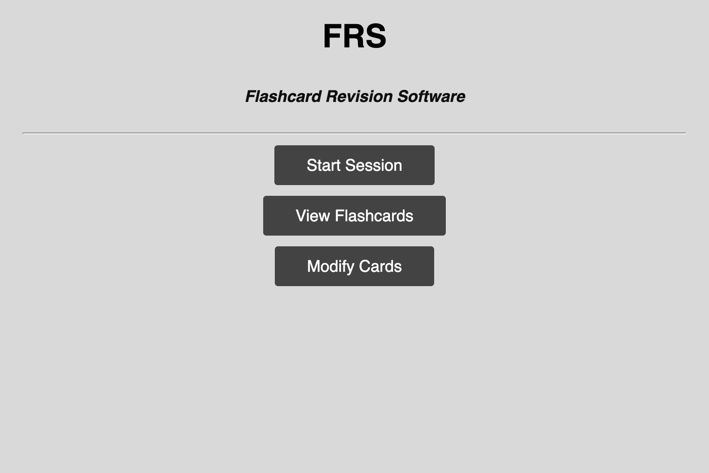
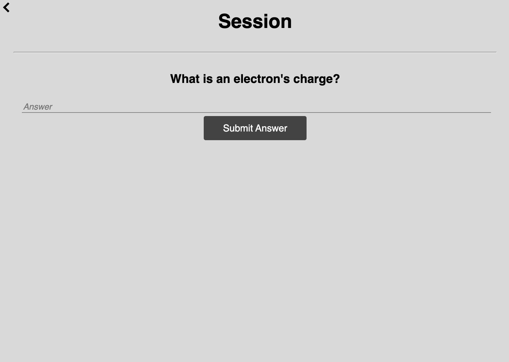
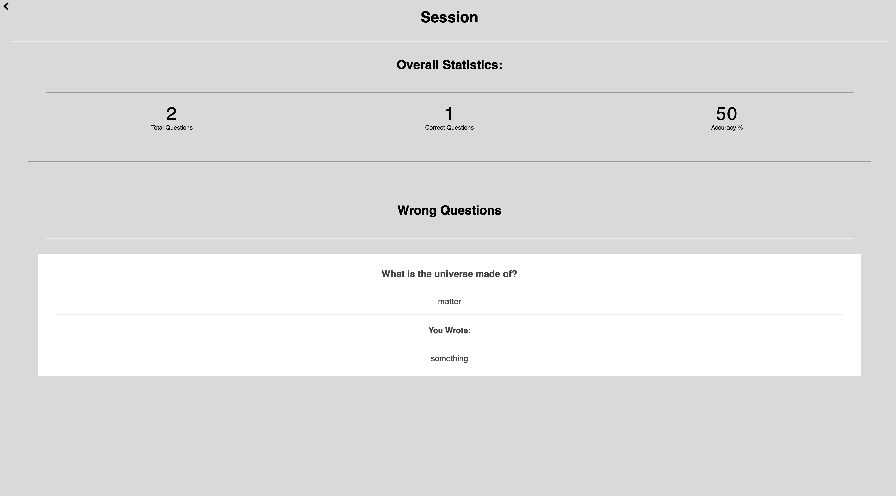
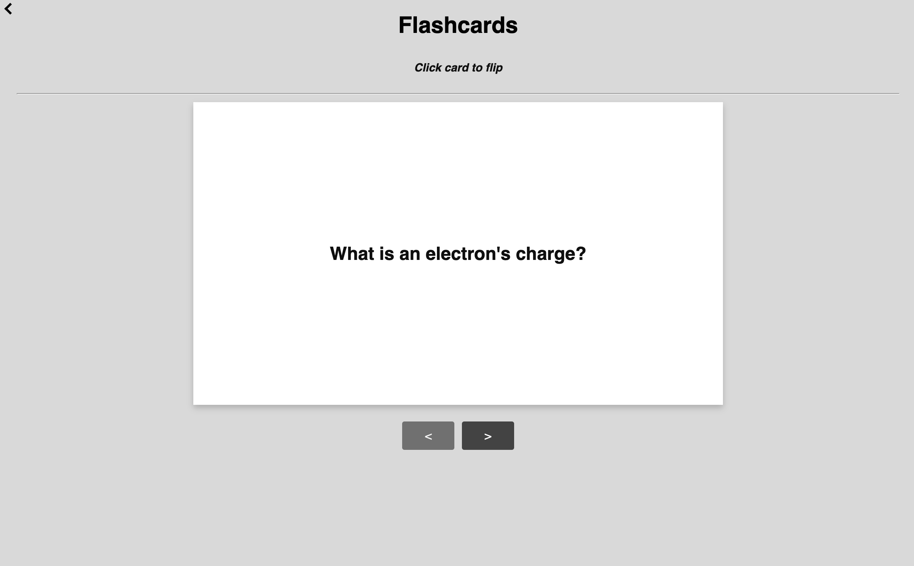
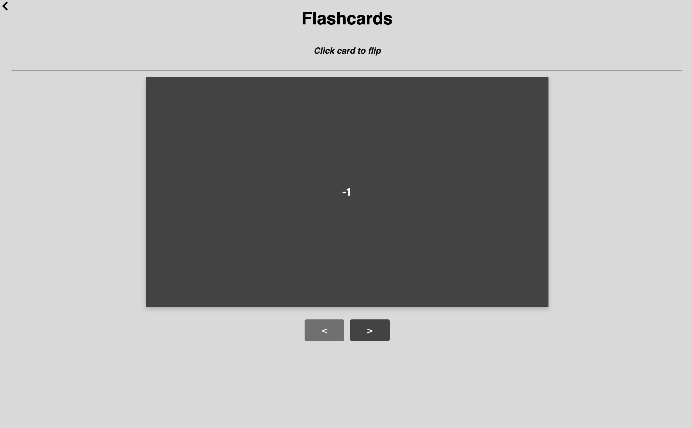
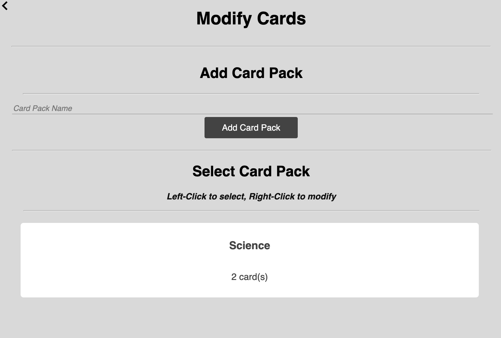
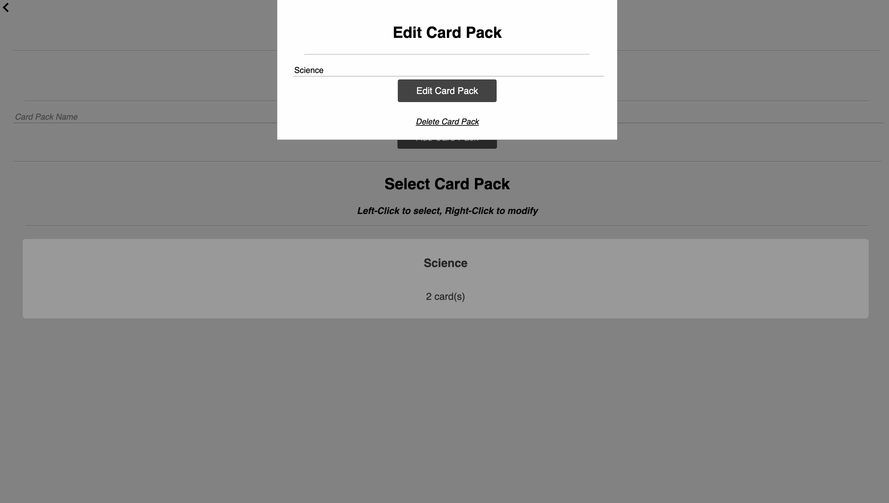
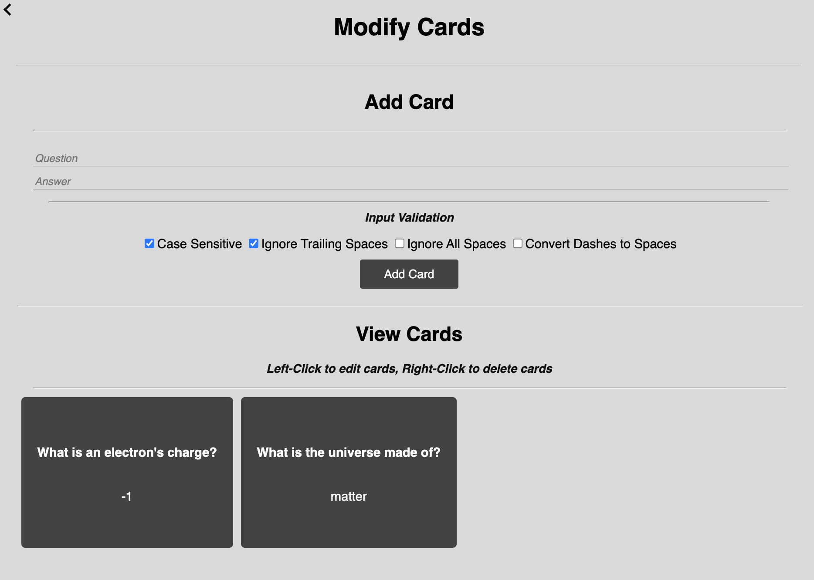
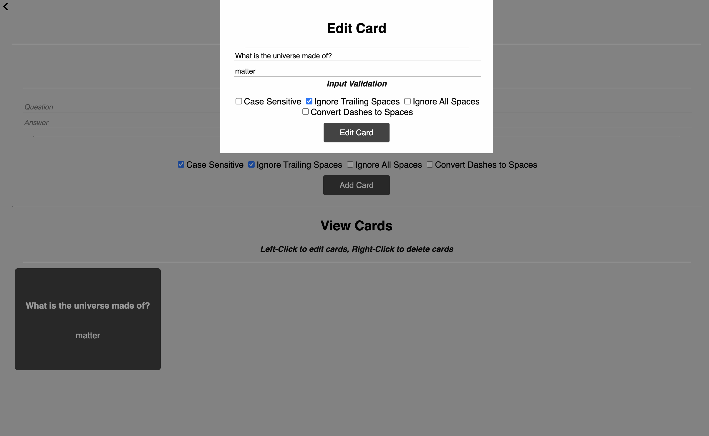

# FRS - Flashcard Revision Software
A desktop application that helps users revise. Users have the ability to create cards, which allows for them to both revise and quiz on said cards.  
  
## Installation
### Packaged Download
You can download the software [here](https://realhuman101.github.io/FRS/downloads/)
### Download with Git and npm
- `git clone https://github.com/realhuman101/FRS.git`
- `npm i`
- `npm i -D`
- `npm start`

## Screenshots
### Homepage
  
*Homepage*

### Session
  
*Mid-Session*  
  

*Session Statistics*

### Flashcards
  
*Viewing flashcard question*  
  
  
*Viewing flashcard answer*

### Modifying Cards

*Selecting or creating card packs*  
  
  
*Modifying a card pack*  

  
*Adding, viewing or deleting cards*
  
  
*Modifying cards*
